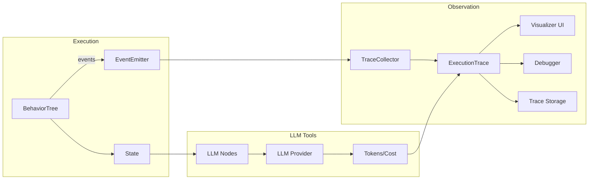

# 🌿 Terrarium

Terrarium is a small, intentional ecosystem for **building and understanding agent behavior**.

It is built around a simple separation of concerns:

- **Vivarium** runs behavior trees — this is where agent behavior *lives*
- **Treehouse** observes behavior trees — this is where agent behavior is *understood*

Execution and interpretation are deliberately decoupled. Agents act first; understanding comes from observation, not interference.

Both components communicate through a shared, semantic event boundary defined in `docs/event-boundary.md`.

---

## Why Terrarium?

As agents grow more capable, their failures become harder to explain.

Logs flatten behavior. Metrics hide intent. Prompts explain goals, not decisions.

Terrarium takes a different approach: it treats **behavior itself as the primary object of study**.

- Vivarium focuses on *doing*
- Treehouse focuses on *seeing*

Together, they form a system where agent behavior can be executed, observed, replayed, and reasoned about — without collapsing everything into a monolithic framework.

---

## What problem this solves

Modern assistants are long‑running, tool‑using, and stateful. Traditional logs and metrics flatten decisions into streams of text and counters, making it hard to see *why* a path was taken, *where* cost accumulated, or *what* changed between steps.

Terrarium makes behavior itself observable. It captures the execution structure (not just outputs), ties decisions to state and costs, and lets you inspect a live agent without coupling interpretation to runtime.

---

## How it feels to use

- Start an agent and watch its tree light up in real time.
- Pause and step through decisions, then inspect each node’s prompt, response, tokens, and cost.
- Replay a trace, compare runs, and spot where time or money was spent.

You get a clear, structured view of behavior without changing how the agent runs.

---

## What’s different from other agent traces

- **Structure first:** traces are behavior trees, not flat logs.
- **Separation of concerns:** execution stays independent from observation.
- **Semantics, not just text:** events represent decisions (entered/exited, success/failure), not just prints.
- **Live introspection:** breakpoints and step‑through without invasive instrumentation.

---

## Architecture

Terrarium is a monorepo containing two Python packages and a shared specification.

```text
terrarium/
├── docs/
│   └── event-boundary.md     # Shared event contract (v0)
├── vivarium/                  # Behavior tree execution engine
│   ├── src/vivarium/core/
│   │   ├── node.py            # Abstract Node base class
│   │   ├── actions.py         # Action leaf nodes
│   │   ├── conditions.py      # Condition leaf nodes
│   │   ├── composites.py      # Sequence, Selector, Parallel
│   │   ├── decorators.py      # Inverter, Repeater, RetryUntilSuccess
│   │   ├── events.py          # Event types and emitter protocol
│   │   ├── context.py         # Execution context (path tracking)
│   │   ├── state.py           # Dict-like state container
│   │   └── tree.py            # BehaviorTree wrapper
│   └── tests/
├── treehouse/                 # Observability and interpretability
│   ├── src/treehouse/
│   │   ├── telemetry.py       # TraceCollector, NodeExecution, ExecutionTrace
│   │   ├── visualization.py   # Terminal trace formatting
│   │   ├── debugging.py       # Breakpoints, step-through, DebuggerTree
│   │   ├── llm_nodes.py       # LLM-backed Action and Condition nodes
│   │   ├── llm_provider.py    # LLM provider protocol and mock
│   │   └── visualizer/        # Web-based trace viewer (FastAPI)
│   └── tests/
└── Makefile                   # Workspace-level CI
```

### How the packages relate

**Vivarium** is a standalone execution engine with no dependencies. It defines the `Node` protocol, composite/decorator/leaf node types, and emits structured events during execution via the `EventEmitter` protocol.

**Treehouse** depends on Vivarium. It implements `EventEmitter` to collect execution events into `ExecutionTrace` objects, which can be formatted, stored, debugged, or streamed to a web UI.

**The event boundary** (`docs/event-boundary.md`) is the contract between the two. Vivarium emits events; Treehouse (and any other observer) consumes them. Execution never depends on observation.

### Event flow

```text
BehaviorTree.tick()
  → node_entered, action_invoked, condition_evaluated, ...
  → node_exited (with result)
  → tick_completed
       ↓
  EventEmitter.emit(event)
       ↓
  TraceCollector → ExecutionTrace → visualization / storage / debugger
```

### System diagram



---

## Quickstart (Visualizer)

```bash
# Terminal 1
make visualizer

# Terminal 2
cd treehouse
python examples/chatbot_with_tools.py --visualize --mock --mock-cost-per-1k 0.01
```

Try prompts like:

- "what time is it?"
- "calculate 12 * (3 + 4)"
- "what did I say last time?"

---

## Development

### Prerequisites

- Python 3.13+
- [uv](https://docs.astral.sh/uv/) for package management

### Setup

```bash
# Install both packages
make install

# Or install individually
cd vivarium && make install
cd treehouse && make install
```

Treehouse uses a workspace path dependency on Vivarium:

```toml
# treehouse/pyproject.toml
[tool.uv.sources]
vivarium = { path = "../vivarium" }
```

### Running checks and tests

```bash
# From the root — runs both packages
make ci        # format + lint + test
make check     # format + lint only
make test      # tests only

# From a package directory
make test              # all tests
make test-unit         # exclude integration tests
make test-integration  # integration tests only
make test-coverage     # tests with coverage report
```

---

## Installation

### From PyPI (coming soon)

```bash
pip install vivarium
pip install treehouse[visualizer]
```

### From source

```bash
git clone https://github.com/ricardokirkner/terrarium.git
cd terrarium
make install
```

---

## Getting Started

### 1. Define a simple tree

```python
from vivarium.core import Action, Sequence, BehaviorTree, NodeStatus

class Greet(Action):
    def execute(self, state):
        print(f"Hello, {state.get('name', 'World')}!")
        return NodeStatus.SUCCESS

tree = BehaviorTree(
    root=Sequence(children=[
        Greet(name="greet")
    ])
)
```

### 2. Observe with Treehouse

```python
from treehouse import TraceCollector

collector = TraceCollector()
tree.set_emitter(collector)

state = {}
tree.tick(state)

trace = collector.get_trace()
print(collector.format_trace(trace))
```

### 3. Watch with the web visualizer

```bash
make visualizer
python examples/chatbot_with_tools.py --visualize --mock
```

Open http://localhost:8000 to see live execution.

---

## Examples

- **chatbot_with_tools.py** — Interactive agent with tool calling and cost tracking
- **llm_agent.py** — LLM-driven decision making with state management
- **combat_ai.py** — Game AI using behavior trees
- **breakpoint_demo.py** — Debugging with breakpoints and step-through

See `treehouse/examples/` for more.

---

## Documentation

- **[Event Boundary](docs/event-boundary.md)** — The contract between Vivarium and Treehouse
- **[Missing Features](MISSING_FEATURES.md)** — Planned features for v0.2+
- **[Contributing](CONTRIBUTING.md)** — How to contribute

---

## Status

Terrarium is **early-stage and experimental**. 

**Current state:**
- ✅ Execution engine (Vivarium) — stable, 236 tests
- ✅ Observability (Treehouse) — stable, 252 tests
- ✅ Event boundary (v0) — stable, well-specified
- ✅ Web visualizer — functional
- ✅ LLM integration (OpenAI, Anthropic, Ollama) — working
- ⚠️ Trace comparison — planned (v0.2)
- ⚠️ Cost visualization — planned (v0.2)
- ⚠️ State snapshots — planned (v0.2)

The separation between execution and interpretation is intentional and foundational. APIs will evolve; the boundary will remain.

---

## License

Terrarium is licensed under the Apache License 2.0. See [LICENSE](LICENSE) for details.

---

## Contributing

Contributions are welcome! Please read [CONTRIBUTING.md](CONTRIBUTING.md) first.

Report issues, suggest features, or submit pull requests on [GitHub](https://github.com/ricardokirkner/terrarium).

---

## Citation

If you use Terrarium in research or production, please cite:

```bibtex
@software{terrarium2026,
  author = {Kirkner, Ricardo},
  title = {Terrarium: Behavior Tree Execution and Observability for LLM Agents},
  url = {https://github.com/ricardokirkner/terrarium},
  year = {2026}
}
```
